## 统信UOS家庭版 - 安装过程

本人是在虚拟机上安装，所以驱动比较容易解决；当然，要想使用虚拟机，必须有较大的内存（至少8G、建议16GB，现在内存不贵，不贵的原因是有国产内存竞争，自然价格就下来了，顶多是500块钱就能解决的问题），对其它硬件的要求倒不是很高。

官方安装教程：[统信UOS使用教程一：统信UOS系统安装方法 - 哔哩哔哩 (bilibili.com)](https://www.bilibili.com/read/cv11848447)

### 目录

- [统信UOS家庭版 - 安装过程](#统信uos家庭版---安装过程)
  - [目录](#目录)
  - [１．前提](#１前提)
  - [２．系统安装](#２系统安装)
  - [３．安装设置](#３安装设置)
  - [４．软件包更新](#４软件包更新)
  - [５．系统设置](#５系统设置)
    - [5.1 系统自动登录](#51-系统自动登录)
    - [5.2 禁止开机选择菜单](#52-禁止开机选择菜单)
    - [5.3 加快鼠标反应速度](#53-加快鼠标反应速度)
    - [5.4 改变电源管理设置](#54-改变电源管理设置)

---

### １．前提
ISO镜像文件

- uniontechos-desktop-home-amd64-13000034.iso

安装条件

- 硬盘64GB以上

### ２．系统安装


- **Boot menu**选择**Install UnionTech OS 20 Home**

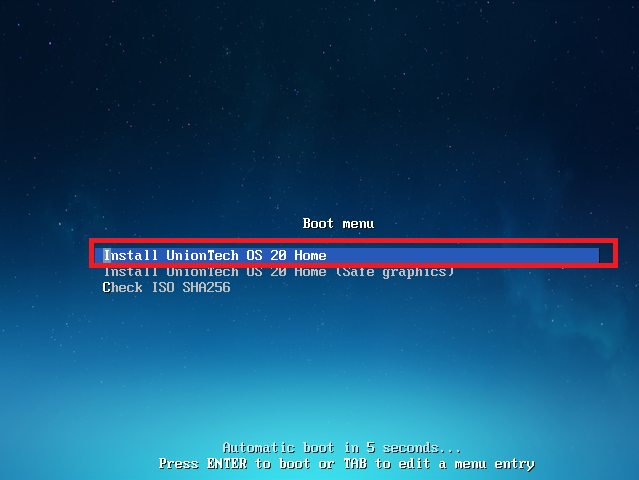

开始安装，进入如下状态：


如下画面显示之后，选择**立即安装**按钮，继续安装。


因为是在虚拟机上全新安装，没有其它复杂选项，安装结束后，显示如下画面，点击**立即重启**按钮，重启系统。


### ３．安装设置

如下画面设置**用户名**、**口令**之后，点击**确认**按钮，继续。


随后显示系统优化画面


稍等一会儿，就进入系统登录画面

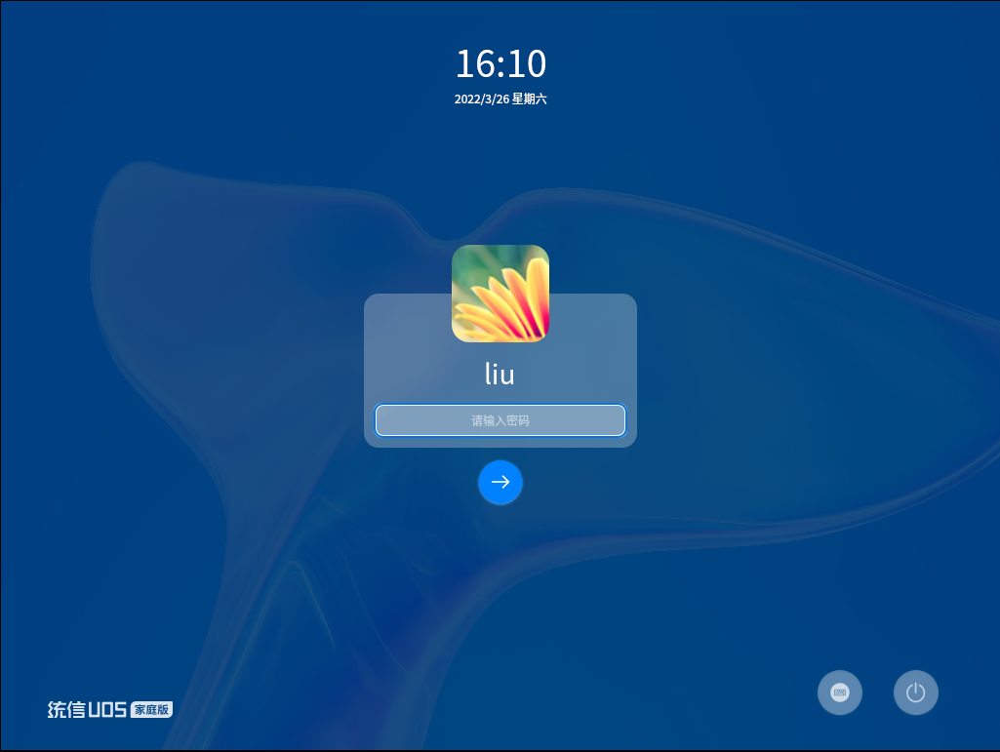

现在的电脑，性能都绰绰有余，体验一下**特效模式**吧。

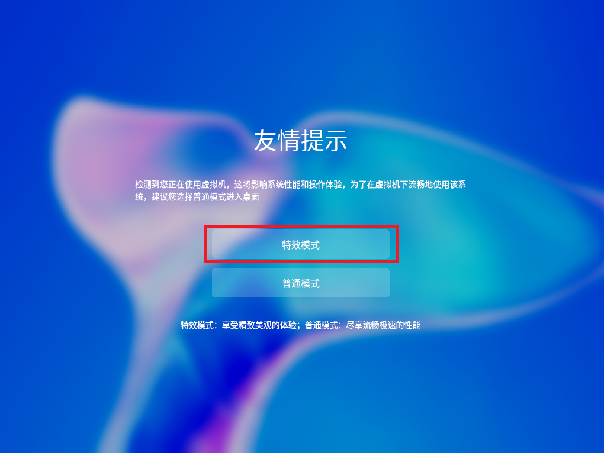

首次进入画面，看起来还不错，点击**立即激活**，看看到底是啥玩意儿？

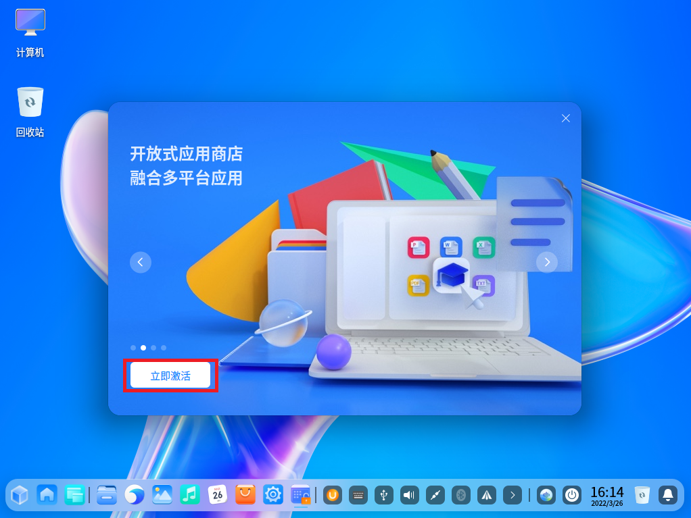

支持国货，微信激活OS。

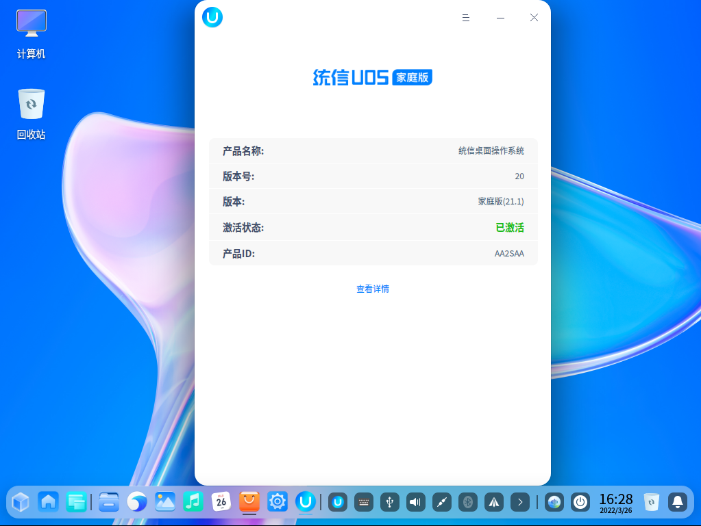

还是终身有效，问题是一个OS能够存活多长时间？

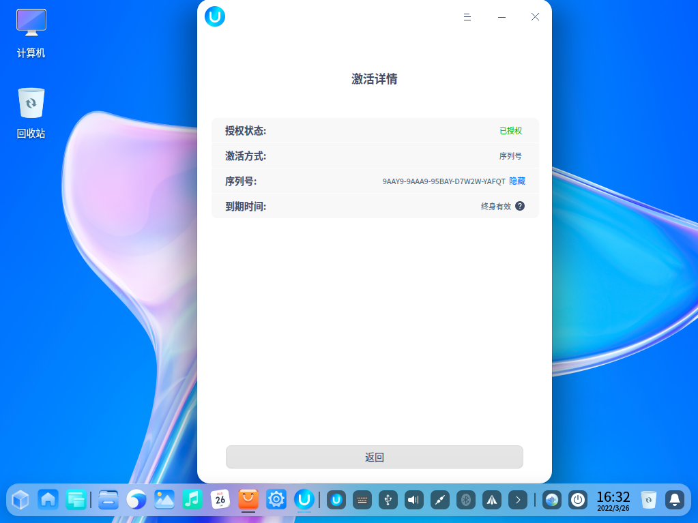


### ４．软件包更新

桌面进入超级终端，输入指令：

```bash
# 只有激活了之后才能够用sudo用户更新软件包
sudo apt update
sudo apt upgrade
```

看来**统信OS**确实是脱胎于**Debian**，但是权限已经做了修改，只能去**控制中心**，进行系统更新。**超级终端**没有了`sudo`这个超级用户的支持，也没有root用户支持，基本就是类似于Windows的Command，已经属于一个比较普通的工具。

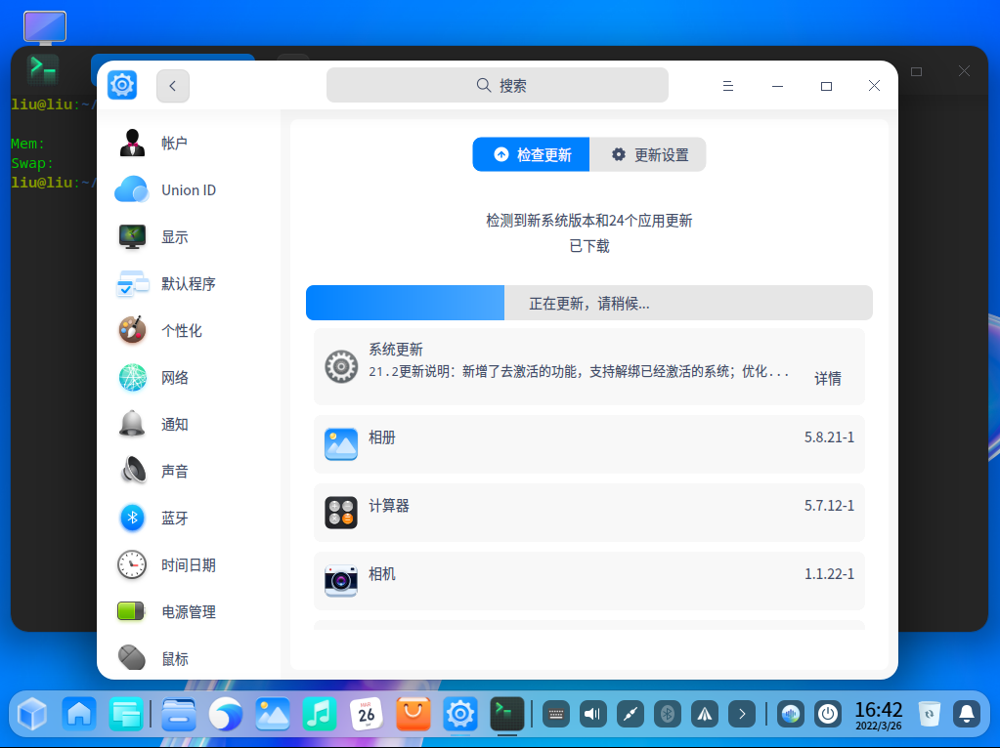

个人是在VMWare上安装的，最关心的就是先把VMWare-Tools这个驱动安装好。

- [统信UOS安装vmware tools教程，解决虚拟机屏幕不自动拉伸适配问题](https://www.bilibili.com/video/BV1o44y1n7t3)

控制面板 → 通用 → 开发模式，然后就和Debian或者Ubuntu一样，可以安装VMWare-Tolls了。

建议正常注册，这样才能用`sudo`模式，功能类似于普通的`Ubuntu`或者`Debian`了，针对希望有探索性的用户，建议还是安装Ubuntu，这个相对稳定；但是通过个人使用感觉，流畅度Debian确实更好，明显感觉界面更加顺滑，缺点是：一不小心就容易宕机、更新严重不及时。

正常能够上网的话，还是用如下指令，更新驱动更加方便。

```bash
sudo apt update
# 因为涉及到软件更新，所有需要回答的地方，有回答 Ｙ　。
sudo apt install open-vm-tools-desktop
```

- https://docs.vmware.com/jp/VMware-Tools/11.3.0/com.vmware.vsphere.vmwaretools.doc/GUID-C48E1F14-240D-4DD1-8D4C-25B6EBE4BB0F.html

### ５．系统设置


#### 5.1 系统自动登录

- 控制中心
  - 用户

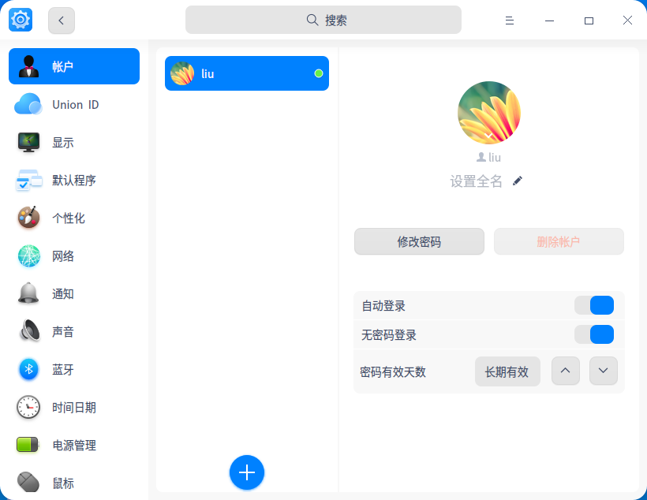

设置之后，每次开机就不需要输入密码了。无需密码登录之后，还出现了一个神奇的效果，OS启动结束，VMWare直接画面自动扩大化了。

#### 5.2 禁止开机选择菜单

画面启动的时候，会暂停`5`秒，可以进行菜单选择，在系统启动出现问题的时，可以通过其它启动项目，进行对应。

禁止该项，加快启动速度，大概是在`86`行和`90`行，2个地方需要从`5`修改为`0` 。

超级终端输入如下指令：

```bash
sudo nano /boot/grub/grub.cfg
sudo gedit /boot/grub/grub.cfg
```

找到如下位置，把2个 `set timeout=5` 都修改为 `set timeout=0`

```
if [ "${recordfail}" = 1 ] ; then
  set timeout=30
else
  if [ x$feature_timeout_style = xy ] ; then
    set timeout_style=menu
    set timeout=5
  # Fallback normal timeout code in case the timeout_style feature is
  # unavailable.
  else
    set timeout=5
  fi
fi
```

#### 5.3 加快鼠标反应速度

- 控制中心
  - 鼠标

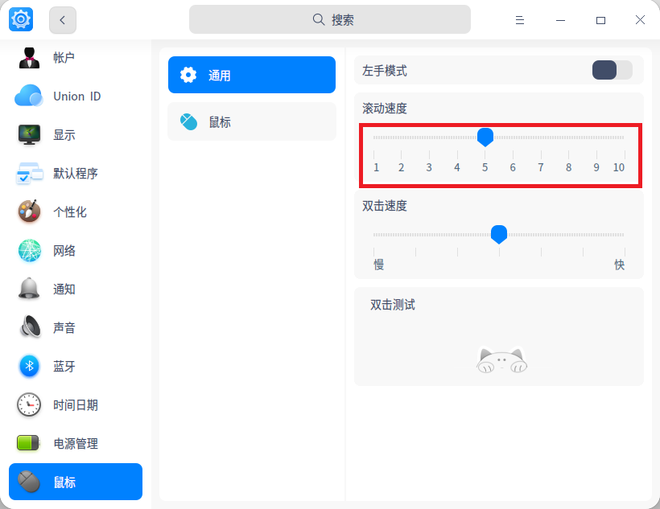

默认速度是 **1** ，太慢了，至少设置为 **5** 

#### 5.4 改变电源管理设置

因为是虚拟机安装的系统，**电源管理**的相关设置尽量都关闭。

- 通用

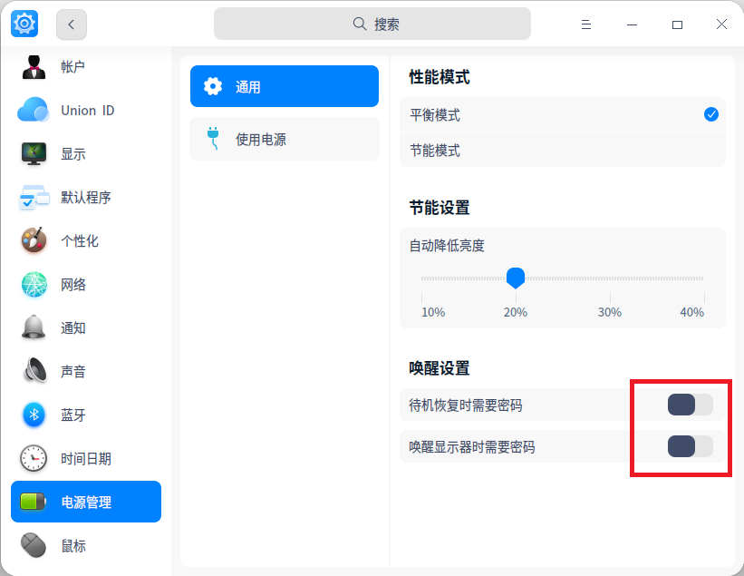

- 使用电源

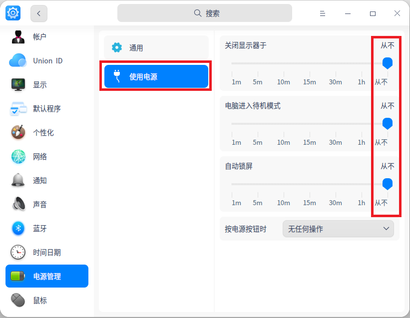
