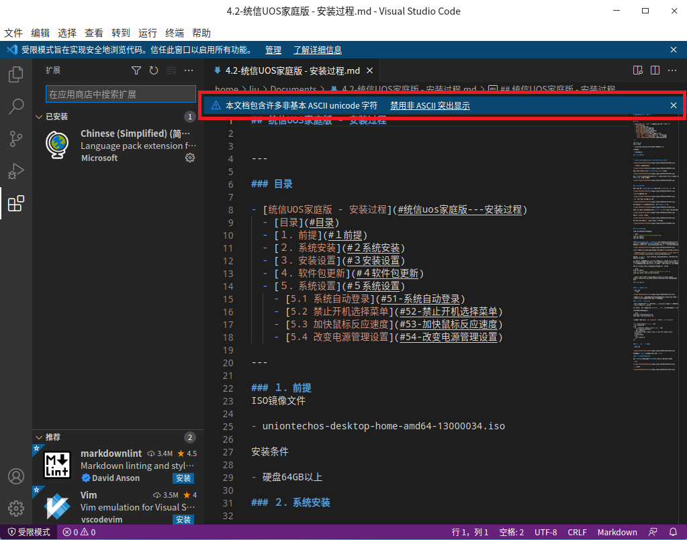

## 统信UOS - VSCode安装、配置、应用

微软出品的这款`Visual Studio Code`软件，不是一般的优秀，并且有微软背书，更新很快，稳定性也很好。强烈每个人不管是用Windows、还是各种版本的Linux，都能安装这款软件，能解决很多问题。关键是免费的，还能有这么好的软件。

### 目录

- [统信UOS - VSCode安装、配置、应用](#统信uos---vscode安装配置应用)
  - [目录](#目录)
  - [１．软件下载](#１软件下载)
  - [２．软件安装](#２软件安装)
  - [３．软件配置](#３软件配置)
    - [3.1 禁用文字突出显示](#31-禁用文字突出显示)
    - [3.2 Markdown关联插件安装](#32-markdown关联插件安装)
    - [3.3 Python开发插件安装](#33-python开发插件安装)

---

### １．软件下载

- 下载地址：https://code.visualstudio.com/

选择**DEB(Debian、Ubuntu)**，统信OS应该是Debian为核心构筑的。

当前最新版本的文件：code_**1.65.2**-1646927742_amd64.deb

### ２．软件安装

- 选择下载文件，鼠标点击右键，在快捷菜单里面选择**打开方式** → **软件包安装器**；
- 软件包安装器画面，点击**安装**按钮；
  - 认证画面，输入用户的**密码**。
  - 回到软件包安装器画面，继续点击**安装**按钮。
- 安装结束之后，点击**完成**按钮，安装结束。
- 删除下载的安装文件，并清空**回收站**。

### ３．软件配置

- 点击**启动器**，找到 **Visual Studio Code** 项目，鼠标点击打开。
- 启动之后，画面的右下角位置，自动提示更新语言包。点击确认安装按钮之后，软件安装语言包，并随后重启。
- VSCode是一个非常优秀的免费工具，不仅可以搞很多开发，还是制作目前流行的Markdown文档，配合git工具，可以非常方便的连接到远端存储库。

#### 3.1 禁用文字突出显示

VSCode针对非基本ASCII Unicode，默认是文字突出显示，在第一次打开含有汉字的文件的时候，如下画面里面会有提示条：

点击**禁用非 ASCII 突出显示**，就解决了，否则所有汉字都有红色框标识，看起来非常痛苦。

如果，忘记了在这里进行设置，后续汉字被突出现实的时候，鼠标悬浮上面，会有**tip**，点上面的链接，选择禁止提示

#### 3.2 Markdown关联插件安装

- 点击扩展快捷按钮（画面左侧从上向下第5个按钮）；
- **在应用商店中搜索扩展**输入框里面，输入 **Markdown** 回车确认；
- 选择 **Markdown All One** 项目，右侧画面里面选择**安装**按钮，开始安装； 按钮文字变为 正在安装 ，安装结束之后，出现 **禁用** 、 **卸载** 按钮，代表安装结束；
  - 当前最新版本是 **V3.4.0**
- 选择 Markdown Preview Github Styling 项目，安装如上一样步骤安装。
  - 当前最新版本 **V1.0.1**

想要了解Markdown相关的知识，请参考：

- [markdown 的常用语法 - 百度文库 (baidu.com)](https://wenku.baidu.com/tfview/25835aa603d276a20029bd64783e0912a2167c86.html?fr=launch_ad&SS-bdtg01&utm_source=bdss-WD&utm_medium=cpc&utm_account=SS-bdtg01&e_creative=54638612614&e_keywordid=342403215832&bd_vid=8151790761723072116)
- [Markdown的基本使用 (baidu.com)](https://baijiahao.baidu.com/s?id=1721269521385203440&wfr=spider&for=pc)

学习`Markdown`相关知识之后，在`VSCode`可以做实践，创建一个新文件，扩展名为`MD`，在编辑的同时，可以打开预览功能；这样画面整体被分割为左右2部分，左侧编辑、右侧预览，是非常方便的编辑模式；当然需要先学习一些`Markdown`的相关知识，不过相对比较简单，对任何有志于学习的同学，都不是问题。

尤其是当前软件开发，软件管理方面`gitlab`和`github`的应用越来越广泛，在软件设计过程中，基本上都是使用`Markdown`方式管理文档，方便资料共享。

#### 3.3 Python开发插件安装

作为解释性软件开发语言，当前Python开发非常流行，用`VSCode`开发`Python`也是一个非常合适的工具。

